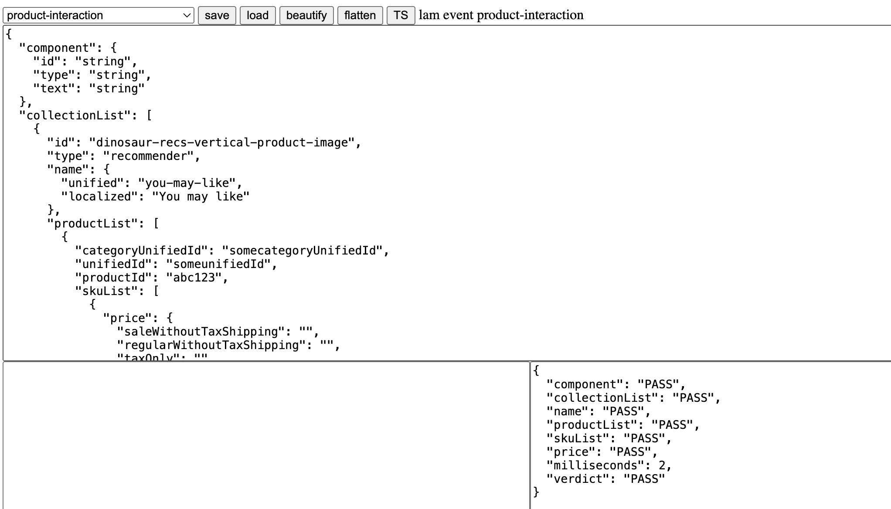

# typescript_sandbox
typescript sandbox

# REPO
https://github.com/mulefish/typescript_sandbox/

# Files of current interest:
version2_tdd.js in the dist dir  
robot.js in the src dir  

# COMMANDS
npm run build // javac    
npm run tdd // test   
npm run server // web server  

# screencap

